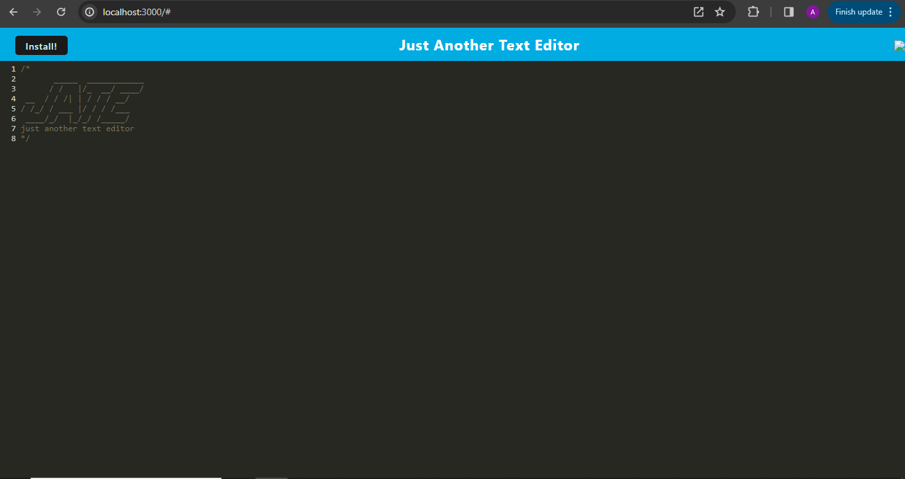
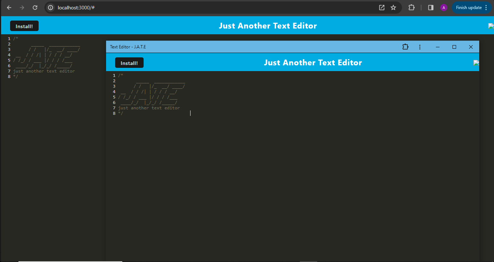
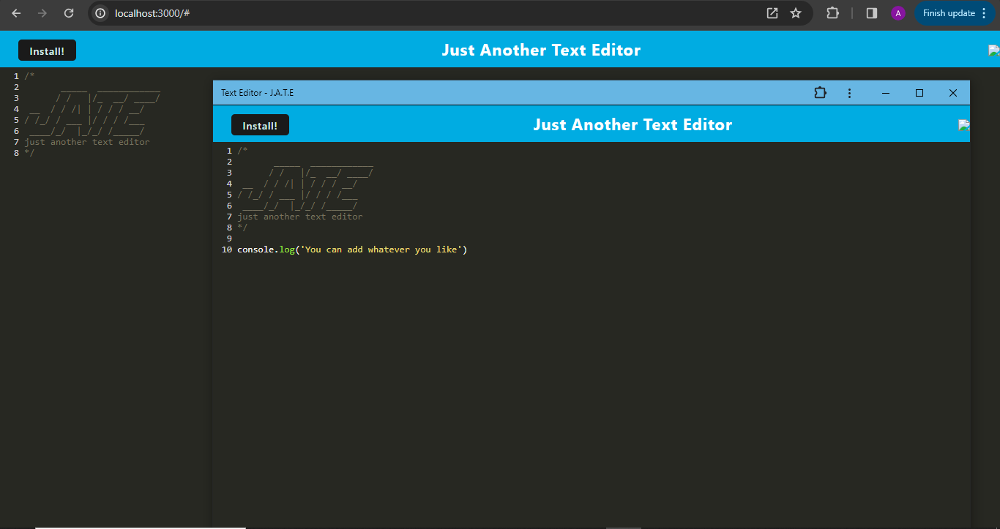

# text-editor

## description
This is a text editor application. I built as a way to test my knowledge of how PWAs work. With this application you are able to edit text like code text. This helped me gain an understanding of PWAs. I was able to stetch myself and gain better abilities with the code.

## usage
To use this application you just type code text into the box. It lets you edit text. It is also a PWA so you can install the application to your device. Once you have done that it has the same functionality. But then it will run without an internet connection. This means that the application can be used anywhere you can take your device.

[Live web application]()